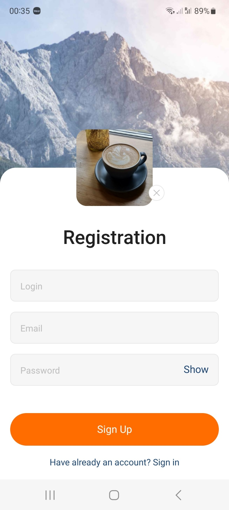
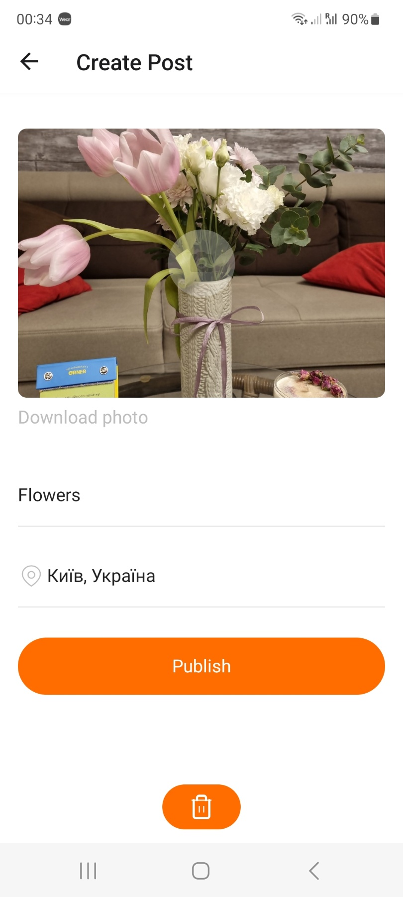

# React Native Photo App

## Main Technologies

React Native, Expo Go, Redux, Firebase Cloud Firestore

## Description

[Live Demo Photo Application - Youtube](https://youtu.be/Wri-7jYoA0Q)

Photo App is a small social network where you can register, take photos by the phone camera and place them in your posts, comment and like the posts of other users. Uses Firebase Cloud Firestore to store the data.






## Deploy

[Link for Expo Go](https://expo.dev/@olgamykhailova/social-network?serviceType=classic)

## Project setup

```
npm install
npm start
```

